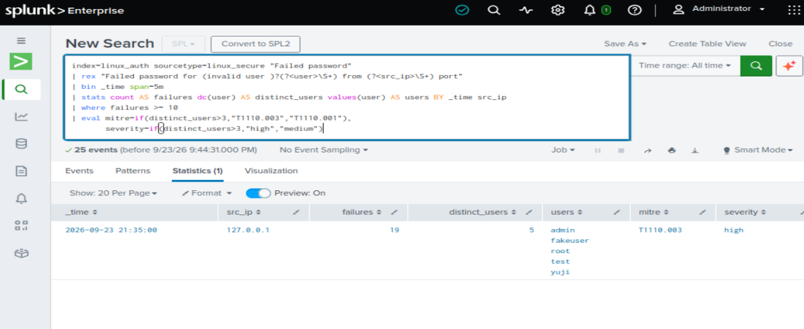
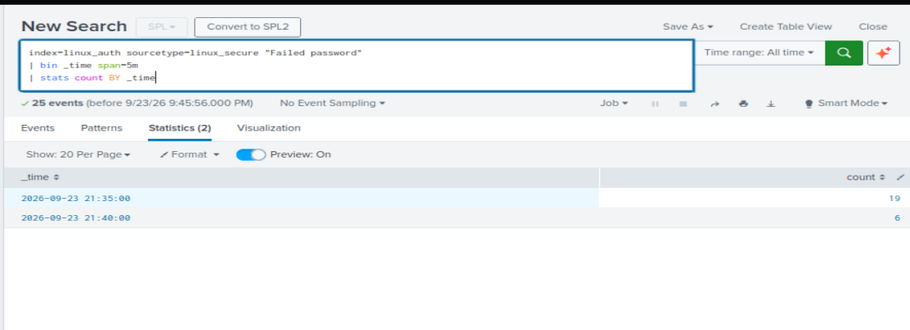
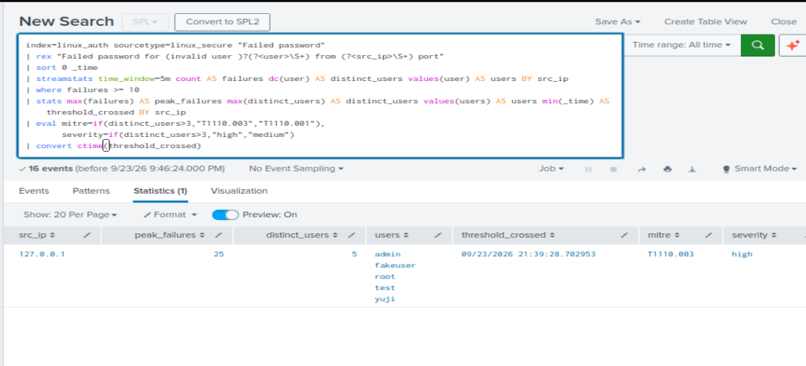
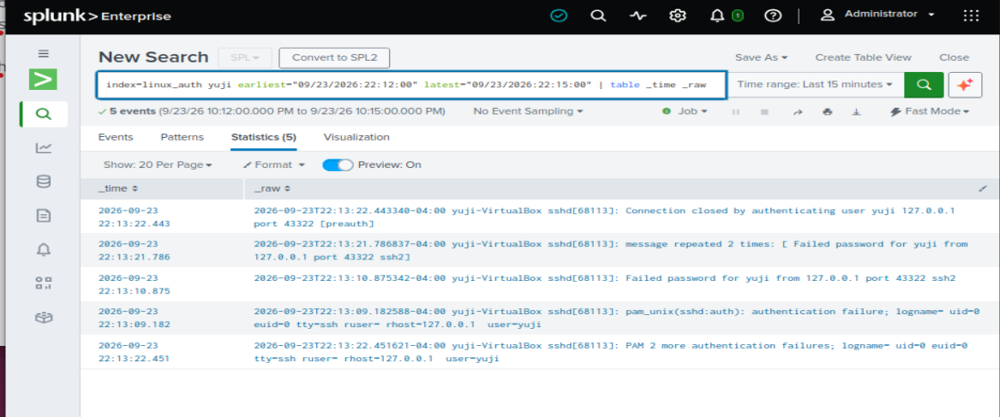
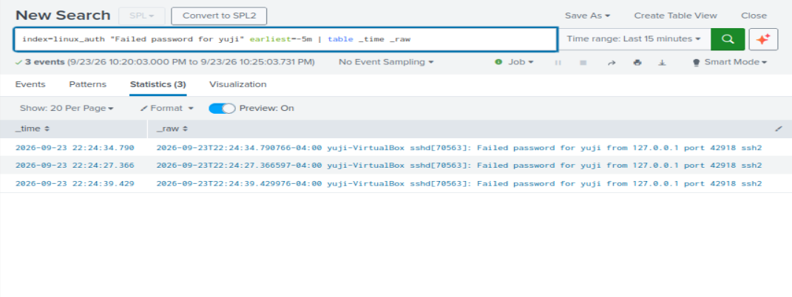
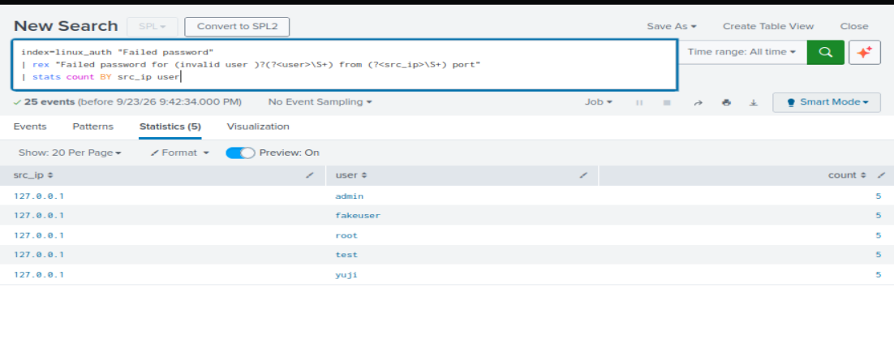
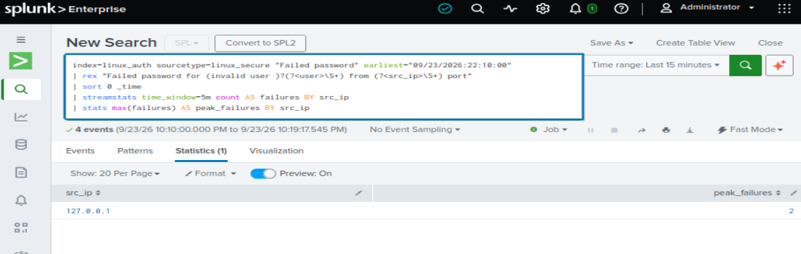
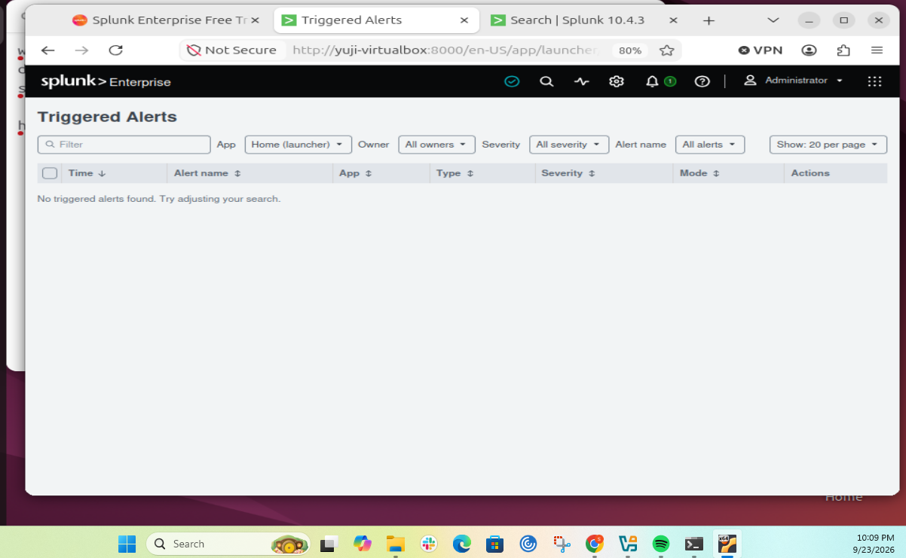

# SSH Brute Force & Password Spray Detection in Splunk

[](https://github.com/Olaoluwa-byte/splunk-ssh-bruteforce-detection/actions/workflows/detection-tests.yml)

End-to-end detection engineering for SSH password guessing (T1110.001) and password spraying (T1110.003) in Splunk Enterprise — from raw log onboarding to a throttled scheduled alert, managed as code and regression-tested in CI.

---

## Executive Summary

**Problem.** A threshold-based brute-force detection looks simple, but small design and pipeline choices can make it silently miss real attacks.

**What I built.** A home-lab SIEM (Ubuntu 24.04 + Splunk 10.4.3), a scripted SSH attack, a sliding-window detection with spraying classification, a throttled scheduled alert, and a CI pipeline that re-runs the detection against real attack logs on every change.

**What validation uncovered.** Three issues that would have weakened this detection in production without anyone noticing:

1. **Evasion gap** — fixed 5-minute buckets caught only **76%** of an attack; a sliding window caught **100%**.
2. **Pipeline blind spot** — rsyslog merged repeated failures, undercounting multi-guess attacks by up to **3×**.
3. **Ground-truth mismatch** — the attack script's "25 attempts" logged as 25, 27, and 27; coverage must be measured against logs, not intent.

**Outcome.** A detection that fires on the 10th failure, correctly classifies spraying vs. brute force, stays quiet on user typos, and cannot regress without failing CI.

### Results

| Measure | Result |
|---|---|
| Coverage, fixed buckets (v1) | 19 / 25 attempts (**76%**) — attack split 19/6 across a bucket boundary |
| Coverage, sliding window (v2) | 25 / 25 (**100%**) — threshold crossed on the 10th failure |
| rsyslog undercount | 3 failures logged as 2 lines → fixed at source **and** in SPL |
| False-positive test | 3 user typos → peak **2** → no alert |
| Scheduled alert | Fired as designed — High severity, one alert per attacker, 60-min throttle |
| CI regression suite (v1.1) | 3/3 passing on every push/PR — attack 25 → alert; collapsed typos 2 lines → 3 attempts, no alert |

### Coverage Gaps (known, prioritized)

| Gap | Impact | Planned mitigation |
|---|---|---|
| Distributed spray (many IPs, few attempts each) | Evades per-`src_ip` grouping | Aggregate by target user across sources |
| Low-and-slow (<10 attempts per 5 min) | Never crosses threshold | 1–24h per-source aggregation |
| Key-based SSH (remote password auth disabled) | Failures log as `publickey`, not `Failed password` — not counted | Extend base search to publickey/preauth failures |
| Success after failures | Compromise not detected | Correlate `Accepted …` after a failure burst (T1078) |
| Frustrated user (4 × 3 typos = 12) | Possible false positive | Higher threshold for single-user bursts |
| Localhost-only attacker | Not a realistic remote source | Kali attacker VM (Project 2) |

### Framework Mapping

| Framework | Mapping |
|---|---|
| MITRE ATT&CK | T1110.001 Password Guessing · T1110.003 Password Spraying |
| NIST SP 800-53 | AC-7 Unsuccessful Logon Attempts · AU-6 Audit Review · SI-4 System Monitoring · CM-3 Configuration Change Control (CI-gated detection changes) |
| CIS Controls v8 | 8.2 Collect Audit Logs · 8.11 Audit Log Reviews · 13.1 Centralize Security Event Alerting |

---

## Appendix

<details>
<summary><b>A. Lab architecture</b></summary>

```
UbuntuDesk VM — Ubuntu Desktop 24.04 LTS (VirtualBox, 8 GB RAM, 4 vCPU)
├── Attacker:  scripts/generate_failed_logins.sh ──► failed SSH password logins to 127.0.0.1:22
├── Victim:    OpenSSH server ──► rsyslog ──► /var/log/auth.log
└── SIEM:      Splunk Enterprise 10.4.3 (non-root 'splunk' user, systemd-managed)
               ├── File monitor ──► index=linux_auth  sourcetype=linux_secure
               └── Scheduled alert (*/5) ──► Triggered Alerts (High)
```

Attacker and victim share one VM (loopback only) — isolated, fully self-generated data. Remote SSH is key-only; password auth is allowed from localhost only so the attack simulation still produces `Failed password` events.

</details>

<details>
<summary><b>B. Detection logic</b></summary>

**Plain English:** count failed SSH password attempts per source IP over a rolling 5 minutes. At **10+**, alert. If **more than 3 usernames** were targeted → password spraying (high); otherwise → brute force (medium).

Source of truth: [`detections/ssh_bruteforce_password_spray.spl`](detections/ssh_bruteforce_password_spray.spl)

```spl
index=linux_auth sourcetype=linux_secure "Failed password"
| rex "Failed password for (invalid user )?(?<user>\S+) from (?<src_ip>\S+) port"
| rex "message repeated (?<repeat_count>\d+) times"
| eval attempts=coalesce(repeat_count, 1)
| sort 0 _time
| streamstats time_window=5m sum(attempts) AS failures dc(user) AS distinct_users
    values(user) AS users BY src_ip
| where failures >= 10
| stats max(failures) AS peak_failures max(distinct_users) AS distinct_users
    values(users) AS users min(_time) AS threshold_crossed BY src_ip
| eval mitre=if(distinct_users>3,"T1110.003","T1110.001"),
    severity=if(distinct_users>3,"high","medium")
| convert ctime(threshold_crossed)
```

| Line | Purpose |
|---|---|
| `rex … (invalid user )?` | Parses both valid- and invalid-user log formats |
| `rex "message repeated …"` + `coalesce` | Weights rsyslog-collapsed lines by their true count (Finding 2) |
| `sort 0 _time` + `streamstats time_window=5m` | Rolling per-source window — no bucket boundaries (Finding 1) |
| `where failures >= 10` | Separates attacks from typos |
| `stats … min(_time)` | One row per attacker; records time-to-detect |
| `eval mitre / severity` | Spraying vs. brute-force classification |

`detections/v1_bin_bucket.spl` is kept to demonstrate the evasion gap.

</details>

<details>
<summary><b>C. Alert configuration</b> — <code>config/savedsearches.conf</code></summary>

| Setting | Value | Rationale |
|---|---|---|
| Schedule | `*/5 * * * *` | Near-real-time without real-time search overhead |
| Time range | `-15m` → `now` | Enough history for the trailing 5-min window |
| Trigger | Results > 0, per result (`alert.digest_mode = 0`) | One alert per attacker |
| Throttle | By `src_ip`, 60 min | Overlapping windows don't re-alert; a *new* attacker still does |
| Action | Triggered Alerts, severity High | |

Data input: `config/inputs.conf` — monitor `/var/log/auth.log` → `index=linux_auth`, `sourcetype=linux_secure`.

</details>

<details>
<summary><b>D. Attack simulation</b></summary>

`scripts/generate_failed_logins.sh` makes 25 failed SSH password logins to localhost across five usernames:

| User | Exists? | Why |
|---|---|---|
| `fakeuser` | No | Produces the `invalid user` log format |
| `admin` | No | Among the most-guessed usernames |
| `root` | Yes (locked) | Top real-world target |
| `test` | No | Common forgotten test account |
| `yuji` | Yes | Produces the valid-user log format |

Five distinct users per source exercises the spraying classification.

</details>

<details>
<summary><b>E. Findings — full evidence</b></summary>

### Finding 1 — Fixed time buckets create an evasion gap

A 25-attempt spray straddled a bucket boundary and split **19 / 6** (21:35 / 21:40 buckets); the 6 fell below threshold and were dropped.

| Version | Captured | Coverage | Time to detect |
|---|---|---|---|
| `bin span=5m` | 19 / 25 | 76% | After bucket evaluation |
| `streamstats time_window=5m` | **25 / 25** | **100%** | **21:39:28 — 10th failure** |

Raw `auth.log` per-minute counts confirm it: 19 events at 21:39, 6 at 21:40.





### Finding 2 — The log pipeline collapsed repeated failures

Three wrong passwords in one connection produced two `Failed password` lines; the third was hidden in a summary:

```
sshd[68113]: Failed password for yuji from 127.0.0.1 port 43322 ssh2
sshd[68113]: message repeated 2 times: [ Failed password for yuji from 127.0.0.1 port 43322 ssh2]
```

**Cause:** Ubuntu's rsyslog default `$RepeatedMsgReduction on`. **Risk:** multi-guess-per-connection tools undercounted up to 3× — a 25-guess attack could register ~9 and never alert.
**Fix (defense in depth):** `$RepeatedMsgReduction off` at the source, and `sum(coalesce(repeat_count,1))` in the SPL for hosts where syslog config isn't controlled.




### Finding 3 — Ground truth comes from logs, not the attack script

Three runs of a 25-attempt script logged **25, 27, 27** failures (some attempts produced two failures ~1 s apart, likely `sshpass` answering a second prompt). All coverage numbers here are measured against logged events.

</details>

<details>
<summary><b>F. Validation evidence</b></summary>

| Test | Expected | Result |
|---|---|---|
| Ingestion | 25 events, 5 users × 5 | ✅ Exact |
| Timestamp parsing | `_time` = raw ISO 8601 | ✅ To the millisecond |
| True positive | Fires, T1110.003 / high | ✅ Peak 25, 5 users |
| Scheduled alert | Triggered Alert, High | ✅ Fired 22:00 EDT |
| False positive | 3 typos → no alert | ✅ Peak 2 |





</details>

<details>
<summary><b>G. Detection-as-code CI (v1.1)</b></summary>

Every push and PR runs the production SPL against real attack logs in a disposable Splunk container; the build fails if detection behavior changes.

1. GitHub Actions (`ubuntu-24.04`) starts `splunk/splunk` pinned by digest to **10.4.3 (build 4174a2deda5d)** — same build as the lab.
2. Each fixture is loaded into its own index via `splunk add oneshot`; the harness waits until the indexed count equals the fixture line count (pipeline-completeness check).
3. The SPL runs **verbatim** (index swapped, `earliest_time=0`); a copy truncated at the threshold measures peak on fixtures that never alert.
4. Asserts peak attempts, alert rows, MITRE technique, and severity.

| Fixture | Raw lines | Weighted attempts | Peak | Alert rows | Labels |
|---|---|---|---|---|---|
| `attack_run1.log` | 25 | 25 | 25 | 1 | T1110.003 / high |
| `typos_collapsed.log` | 2 | **3** | 3 | 0 | — |
| `typos_fixed.log` | 3 | 3 | 3 | 0 | — |

`typos_collapsed` is the key regression test: remove the repeat-count weighting and it fails.

**Fixtures** are extracted from `/var/log/auth.log` (ground truth), filtered to `sshd[` lines (drops `sudo` audit entries that echo "Failed password"), with NUL bytes from an unclean shutdown stripped (`grep -a`, `tr -d '\000'`).

**Operating rules**
- Change SPL in the repo first → CI green → update the saved search (manual deploy for now).
- `THRESHOLD` in `tests/run_tests.py` must match `| where failures >= 10`; a mismatch fails loudly.
- Bump the pinned image digest in the same PR as any lab Splunk upgrade.
- Container runs in UTC, so `threshold_crossed` is intentionally not asserted.

**Run locally**

```bash
export SPLUNK_PASSWORD='<8+ chars>'
./tests/start_splunk.sh && python3 tests/run_tests.py
docker rm -f splunk-ci
```

</details>

<details>
<summary><b>H. Repository structure</b></summary>

```
├── .github/workflows/detection-tests.yml   # CI
├── config/
│   ├── inputs.conf                         # auth.log → index=linux_auth
│   └── savedsearches.conf                  # alert: search, schedule, throttle, severity
├── detections/
│   ├── ssh_bruteforce_password_spray.spl   # production SPL (source of truth, CI-tested)
│   ├── v1_bin_bucket.spl                   # fixed-bucket version (shows the gap)
│   └── v2_streamstats_sliding.spl          # sliding-window version (development history)
├── scripts/generate_failed_logins.sh       # attack simulation
├── screenshots/                            # evidence (01–05b)
└── tests/
    ├── fixtures/*.log                      # raw auth.log extracts
    ├── start_splunk.sh                     # pinned Splunk container
    └── run_tests.py                        # ingest, search via REST, assert
```

</details>

<details>
<summary><b>I. Reproduce it</b></summary>

Prerequisites: Ubuntu 24.04 VM (8 GB RAM), Splunk Enterprise `.deb` (free trial).

```bash
# 1. Splunk as a non-root service
sudo dpkg -i splunk-*.deb
sudo chown -R splunk:splunk /opt/splunk
sudo usermod -aG adm splunk                 # read access to /var/log/auth.log
sudo -u splunk /opt/splunk/bin/splunk start --accept-license
sudo -u splunk /opt/splunk/bin/splunk stop
sudo /opt/splunk/bin/splunk enable boot-start -systemd-managed 1 -user splunk
sudo systemctl start Splunkd

# 2. Victim service + attack tooling
sudo apt install -y openssh-server sshpass

# 3. Log every failure individually (Finding 2)
sudo sed -i 's/^\$RepeatedMsgReduction on/$RepeatedMsgReduction off/' /etc/rsyslog.conf
sudo systemctl restart rsyslog

# 4. Create index 'linux_auth', deploy config/*.conf to
#    /opt/splunk/etc/apps/<your_app>/local/, restart Splunk

# 5. Attack
./scripts/generate_failed_logins.sh
```

Then run the detection over the last 15 minutes, or check **Activity → Triggered Alerts**.

**Lab notes:** the Splunk trial converts to Free after 60 days (alerting disabled) — use a Developer license. Shut the VM down gracefully; hard power-offs left NUL bytes in `auth.log`.

</details>

<details>
<summary><b>J. Next steps (Project 2)</b></summary>

**Now live:** [splunk-ssh-account-compromise-detection](https://github.com/Olaoluwa-byte/splunk-ssh-account-compromise-detection) — success-after-failures (T1078) and key-only remote brute-force (T1110) detections, CI-tested.

</details>

---

**Samson Amosu** — Security Engineer (detection engineering, Splunk ES) · [LinkedIn](https://www.linkedin.com/in/samson-amosu) · [GitHub](https://github.com/Olaoluwa-byte)
